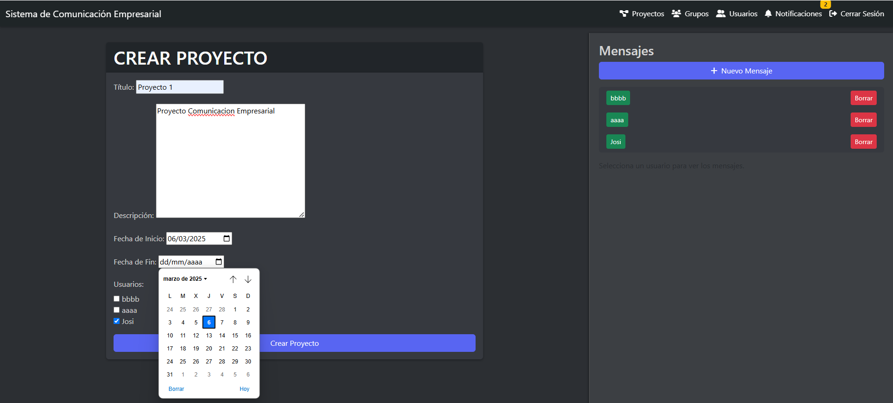
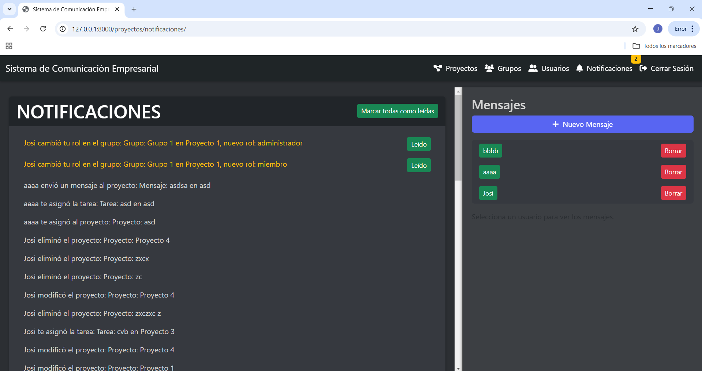
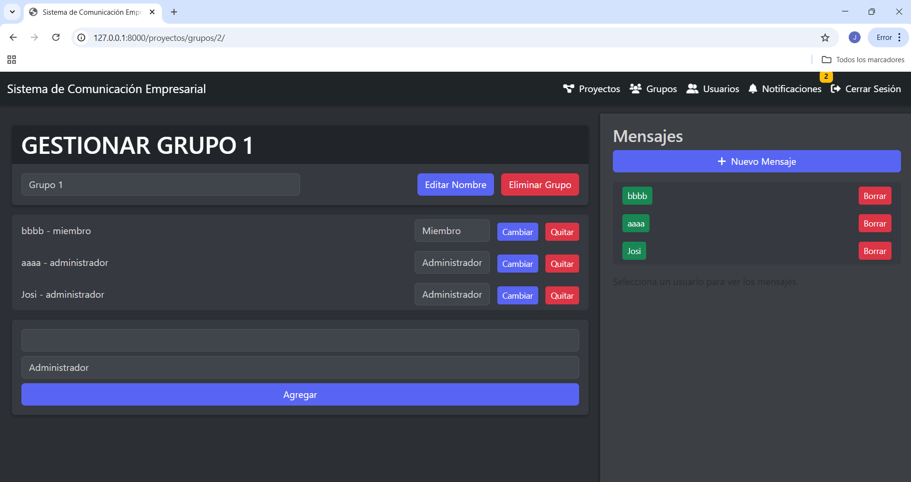
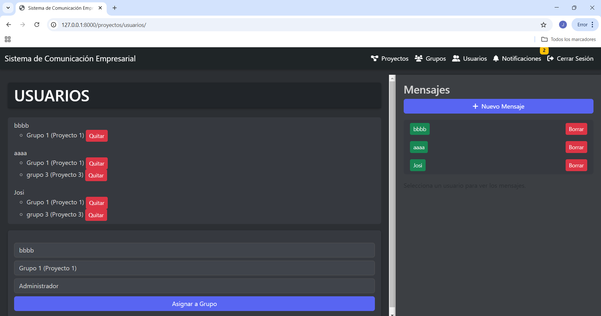

# Anexo de Documentación: Sistema de Comunicación Empresarial

Este anexo amplía la documentación del proyecto "Sistema de Comunicación Empresarial" con detalles técnicos y funcionales para desarrolladores y usuarios finales. Se basa en el archivo `README.md` existente y aborda aspectos específicos de implementación, uso y mantenimiento.

---

## 1. Documentación Técnica (para desarrolladores)

### 📌 Requisitos del Proyecto

#### Objetivo del proyecto
Desarrollar una aplicación web que facilite la comunicación y colaboración empresarial mediante la gestión de proyectos, tareas, grupos, usuarios y mensajes, con un sistema de notificaciones en tiempo real.

#### Alcance y funcionalidades principales
- Gestión de proyectos (crear, editar, eliminar).
- Asignación y manejo de tareas dentro de proyectos.
- Creación y administración de grupos de usuarios.
- Comunicación mediante mensajes privados y mensajes asociados a proyectos.
- Notificaciones automáticas para eventos relevantes (asignaciones, modificaciones, eliminaciones).
- Registro y autenticación de usuarios.

#### Tecnologías utilizadas
- **Django 5.1.6**: Framework web para backend.
- **PostgreSQL**: Base de datos relacional.
- **django-notifications-hq 1.7.0**: Sistema de notificaciones.
- **Bootstrap 5**: Framework CSS para la interfaz.
- **Font Awesome**: Iconos para la UI.
- **Python 3.13.1**: Lenguaje de programación.

#### Requisitos del sistema (hardware/software)
- **Hardware**: Mínimo 4 GB de RAM, 10 GB de espacio libre (desarrollo).
- **Software**: 
  - Sistema operativo: Windows, Linux o MacOS.
  - Python 3.13.1.
  - PostgreSQL 13+.
  - Navegador moderno (Chrome, Firefox, Edge).

### 📌 Guía de Instalación y Configuración

#### Requisitos previos
- Python 3.13.1 instalado.
- PostgreSQL instalado y corriendo.
- Dependencias listadas en `requirements.txt`.
- Entorno virtual (`venv`) recomendado.

#### Instalación del proyecto
1. Clonar el repositorio:

```bash
git clone https://github.com/JosiasmDev/ent_com_sis.git
cd comunicacion_empresa
```

2. Crear y activar un entorno virtual:

```bash
python -m venv venv
.\venv\Scripts\activate  # Windows
source venv/bin/activate  # Linux/Mac
```

3. Instalar dependencias:

```bash
pip install -r requirements.txt
```

#### Configuración del entorno
- Crear un archivo `.env` (opcional) en la raíz para variables sensibles:

DATABASE_NAME=comunicacion_empresa
DATABASE_USER=postgres
DATABASE_PASSWORD=tu_contraseña
DATABASE_HOST=localhost
DATABASE_PORT=5432

- Editar `comunicacion_empresa/settings.py` para usar `.env` o configurar directamente:

DATABASES = {
'default': {
'ENGINE': 'django.db.backends.postgresql',
'NAME': 'comunicacion_empresa',
'USER': 'postgres',
'PASSWORD': 'tu_contraseña',
'HOST': 'localhost',
'PORT': '5432',
}
}

#### Ejecución del servidor

```bash
python manage.py runserver
```


#### Migraciones de la base de datos
1. Crear migraciones:

```bash
python manage.py makemigrations
```

2. Aplicar migraciones:

```bash
python manage.py migrate
```


### 📌 Estructura del Proyecto

#### Explicación de los directorios y archivos clave
- `comunicacion_empresa/`:
- `settings.py`: Configuración global (base de datos, apps instaladas).
- `urls.py`: Rutas principales del proyecto.
- `gestion/`:
- `models.py`: Definición de modelos (Proyecto, Tarea, Mensaje, etc.).
- `views.py`: Lógica de las vistas (CRUD, mensajería, notificaciones).
- `urls.py`: Rutas específicas de la app `gestion`.
- `forms.py`: Formularios para proyectos, tareas y mensajes.
- `templates/gestion/`: Plantillas HTML (proyectos, tareas, notificaciones).
- `templates/registration/`: Plantillas de autenticación (login, registro).
- `static/`: Archivos CSS, JS y fuentes (Bootstrap, Font Awesome).
- `manage.py`: Script de gestión de Django.

#### Uso de Django Apps
El proyecto usa una sola app (`gestion`) para centralizar la lógica, siguiendo un enfoque monolítico.

#### Arquitectura del software
- **Patrón MVC**: Django implementa Model-View-Controller:
- **Modelos**: Definidos en `models.py`.
- **Vistas**: Lógica en `views.py`.
- **Controladores**: URLs en `urls.py` y manejo de solicitudes por Django.
- **Patrones usados**: 
- **Decorator Pattern**: Uso de `@login_required` para restringir acceso.
- **ORM**: Relaciones ManyToMany y ForeignKey para gestionar datos.

### 📌 Base de Datos y Modelos

#### Diagrama de la base de datos (ERD)

[User] ---M:N--- [Proyecto] ---1:N--- [Tarea] ---1:N--- [Comentario]
|                |                |
|                |---1:N--- [MensajeProyecto]
|                |
|---M:N--- [Grupo]
|
|---1:N--- [Rol]
|
|---1:N--- [Mensaje]


- **User**: Modelo de Django (`auth_user`).
- **Proyecto**: Campos: `titulo`, `descripcion`, `fecha_inicio`, `fecha_fin`, `creador`, `usuarios`.
- **Tarea**: Campos: `titulo`, `descripcion`, `estado`, `fecha_limite`, `proyecto`, `asignados`.
- **Comentario**: Campos: `contenido`, `autor`, `tarea`.
- **Mensaje**: Campos: `contenido`, `remitente`, `destinatario`, `leido`.
- **MensajeProyecto**: Campos: `contenido`, `remitente`, `proyecto`.
- **Grupo**: Campos: `nombre`, `proyecto`, `miembros`.
- **Rol**: Campos: `usuario`, `proyecto`, `rol`.

#### Explicación de cada modelo y relaciones
- **Proyecto**: Relaciona usuarios (`ManyToMany`) y tiene tareas/mensajes (`ForeignKey`).
- **Tarea**: Pertenece a un proyecto y tiene asignados (`ManyToMany` con `User`).
- **Mensaje**: Comunicación uno-a-uno entre usuarios.
- **MensajeProyecto**: Comunicación grupal en un proyecto.
- **Grupo**: Agrupa usuarios dentro de un proyecto.
- **Rol**: Define permisos por usuario en proyectos.

#### Uso de migraciones
- Crear migraciones: `python manage.py makemigrations`.
- Aplicar migraciones: `python manage.py migrate`.

### 📌 APIs y Endpoints
(No aplica actualmente, pero se puede extender con Django REST Framework si se requiere).

### 📌 Manejo de Errores y Logs

#### Políticas de manejo de errores
- Uso de `try-except` en vistas críticas (ejemplo: `get_object_or_404`).
- Redirección a páginas de error personalizadas (ejemplo: `sin_permiso.html`).

#### Registro de logs
- Configurado en `settings.py`:

LOGGING = {
'version': 1,
'disable_existing_loggers': False,
'handlers': {
'console': {
'class': 'logging.StreamHandler',
},
},
'root': {
'handlers': ['console'],
'level': 'INFO',
},
}


#### Mensajes de error comunes y soluciones
- **TemplateDoesNotExist**: Crear la plantilla faltante (ejemplo: `registration/login.html`).
- **NoReverseMatch**: Añadir la ruta faltante en `urls.py`.
- **DatabaseError**: Verificar conexión a PostgreSQL en `settings.py`.

### 📌 Pruebas y Deployment

#### Pruebas unitarias y de integración
- No implementadas actualmente. Se recomienda usar `unittest` o `pytest` para probar vistas y modelos.

#### Deployment
- **Docker**: Crear un `Dockerfile`:

FROM python:3.13-slim
WORKDIR /app
COPY requirements.txt .
RUN pip install -r requirements.txt
COPY . .
CMD ["python", "manage.py", "runserver", "0.0.0.0:8000"]

- **Heroku**: Usar `Procfile` y `gunicorn`.

#### Configuración de CI/CD
- Ejemplo con GitHub Actions:

name: CI
on: [push]
jobs:
build:
runs-on: ubuntu-latest
steps:

uses: actions/checkout@v3
name: Set up Python uses: actions/setup-python@v4 with: python-version: '3.13'
name: Install dependencies run: pip install -r requirements.txt
name: Run migrations run: python manage.py migrate


## 2. Documentación Funcional (para usuarios o clientes)

### 📌 Manual de Usuario

#### Cómo acceder al sistema
1. Abre el navegador en `http://127.0.0.1:8000/`.
2. Inicia sesión en `/login/` con tu usuario y contraseña.
3. Si eres nuevo, regístrate en `/proyectos/registro/`.

#### Uso de cada funcionalidad con capturas de pantalla
- **Lista de proyectos**: Ve a `/proyectos/` para ver todos los proyectos.
**.
- **Crear proyecto**: En `/proyectos/crear/`, completa el formulario y selecciona usuarios.
**.
- **Notificaciones**: Revisa `/proyectos/notificaciones/` para ver alertas.
**.
- **Grupos**: Ve a `/grupos/` para ver todos los grupos.
**.
- **Usuarios**: Ve a `/usuarios/` para ver todos los usuarios.
**.

#### Recuperación de contraseña, manejo de sesiones
- Usa `/password_reset/` (Django auth) para recuperar contraseña.
- Cierra sesión desde la cabecera.

### 📌 Casos de Uso

#### Flujos de usuario
- **Crear proyecto**:
1. Inicia sesión.
2. Ve a `/proyectos/crear/`.
3. Rellena el formulario y asigna usuarios.
4. Guarda y verifica notificaciones.
- **Enviar mensaje al proyecto**:
1. Ve a `/proyectos/<id>/mensajes/enviar/`.
2. Escribe el mensaje y envía.
3. Los usuarios asignados reciben notificación.

#### Ejemplos de escenarios comunes
- **Asignar tarea**: Un administrador crea una tarea y asigna usuarios, quienes reciben notificaciones.
- **Eliminar proyecto**: El creador elimina un proyecto, notificando a todos los asignados.

### 📌 Requisitos de Seguridad

#### Políticas de autenticación y autorización
- Autenticación con `django.contrib.auth`.
- Autorización con `@login_required` y roles (`Rol`).

#### Protección contra ataques
- **SQL Injections**: Uso de ORM de Django.
- **XSS**: Escapado automático en plantillas.
- **CSRF**: Tokens CSRF en formularios.

### 📌 Preguntas Frecuentes (FAQ)

#### Problemas comunes y soluciones
- **"No puedo iniciar sesión"**: Verifica usuario/contraseña o crea un nuevo usuario con `createsuperuser`.
- **"No veo notificaciones"**: Asegúrate de estar asignado a un proyecto/tarea.
- **"Error 404 al marcar notificaciones"**: Verifica que la notificación exista en la base de datos.

---